

<!--

You can also find my articles on <u><a href="{{author.googlescholar}}">my Google Scholar profile</a>.</u>

-->
PhD Thesis(1), TPAMI(1), TIP(1), CVPR(4), ECCV(2), ICCV(1), NIPS(2), BMVC(1), IROS(2), ICRA(4), WACV(1), ACCV(1).

[My Google Scholar profile](https://scholar.google.com.au/citations?user=Rfj56F4AAAAJ&hl=en "Google Scholar")

|  2018 |   |
|---|---|
|| K. Li, **T. Pham**, H. Zhan, I. Reid   Efficient Dense Point Cloud Object Reconstruction using Deformation Vector Fields  ECCV 2018|
|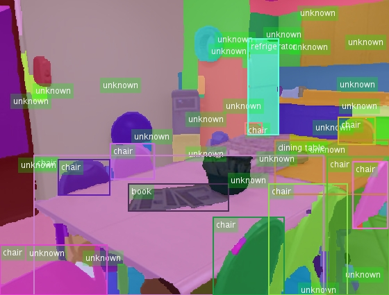 | **T. Pham**, V BG Kumar, T-T Do, G Carneiro, I Reid   Bayesian Instance Segmentation in Open Set World   ECCV 2018|
|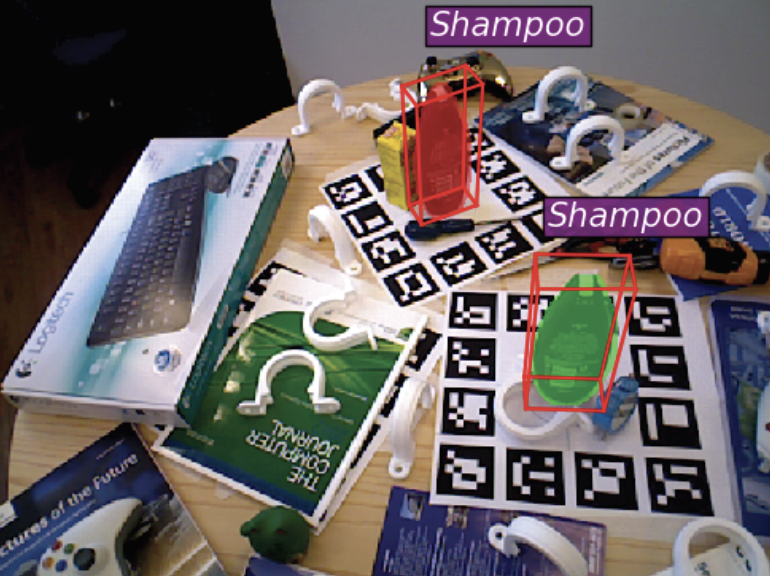|T-T Do, **T. Pham**, M. Cai, I. Reid    LieNet: Real-time Monocular Object Instance 6D Pose Estimation   BMVC 2018 (Oral) |
||M Hosseinzadeh, Y Latif, **T. Pham**, N Suenderhauf, I Reid   Structure Aware SLAM using Quadrics and Planes    RSS-LAIR workshop, 2018|
|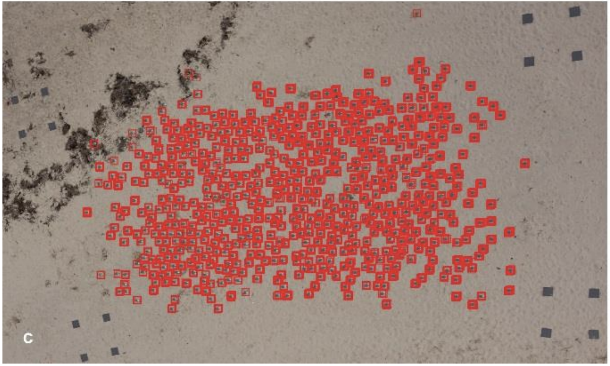|JC Hodgson et al. **T. Pham** et al.    Drones count wildlife more accurately and precisely than humans    Methods in Ecology and Evolution 2018|
|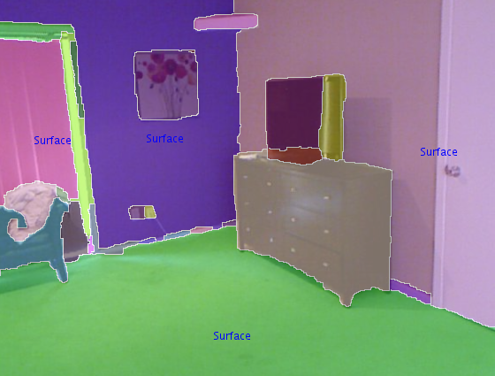|**T. Pham**, TT Do, N. Snderhauf, I. Reid SceneCut: Joint Geometric and Object Segmentation for Indoor Scenes ICRA 2018|
|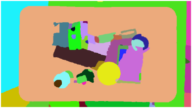|A Milan, **T. Pham** et al.   Semantic segmentation from limited training data   ICRA 2018|
|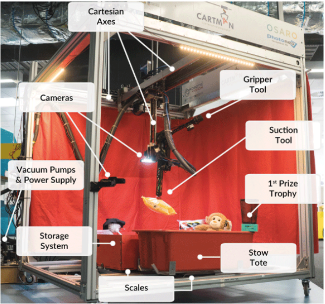|D. Morrison et al. **T. Pham** et al.   Cartman: The low-cost Cartesian Manipulator that won the Amazon Robotics Challenge   ICRA 2018|
|2107| |
|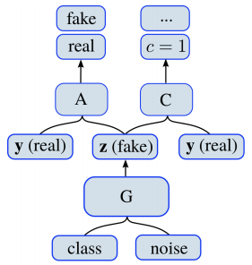 |T. Tran, **T. Pham**, G. Carneiro, L. Palmer, I. Reid   A Bayesian Data Augmentation Approach for Learning Deep Models   NIPS 2017|
|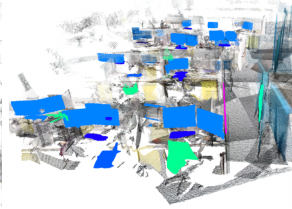| N. Snderhauf, **T. Pham**, Y. Latif, M. Milford, I. Reid   Meaningful Maps - Object-Oriented Semantic Mapping   IROS 2017|
||T.T. Do, D-K L Tan, **T. Pham**, N-M Cheung   Simultaneous Feature Aggregating and Hashing for Large-scale Image Search   CVPR 2017|
|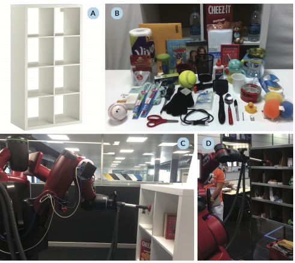| J Leitner et al, **T. Pham**, et al.    The ACRV Picking Benchmark (APB): A Robotic Shelf Picking Benchmark to Foster Reproducible Research   ICRA 2017|
|2016| |
|| **T. Pham**, M. Eich, I. Reid and G. Wyeth   Geometrically Consistent Plane Extraction for Dense Indoor 3D Maps Segmentation   IROS 2016|
|| **T. Pham**, H. Rezatofighi, T-J Chin, I. Reid   Efficient Point Process Inference for Large-scale Object Detection   CVPR 2016|
|2015| |
|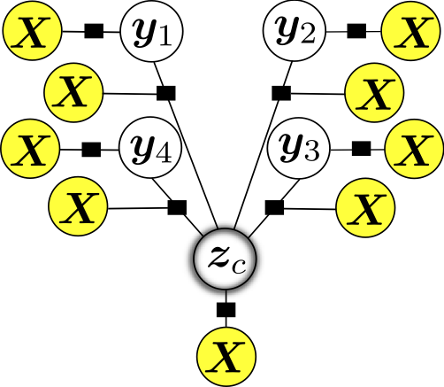|**T. Pham**, I. Reid, S. Gould, Y. Latif   Hierarchical Higher-order Regression Forest Fields: An Application to 3D Indoor Scene Labelling  ICCV 2015 |
|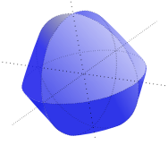|A. Eriksson, **T. Pham**, T.-J. Chin and I. Reid   The k-support norm and convex envelopes of cardinality and rank    In Computer Vision and Pattern Recognition (CVPR), 2015|
|2014||
|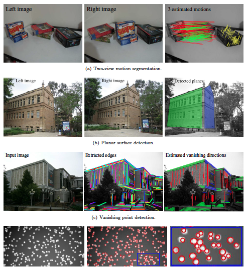|**T. Pham**   Robust Parameter Estimation in Computer Vision: Optimisation Methods and Applications    PhD thesis, School of Computer Science, The University of Adelaide, April, 2014.|
|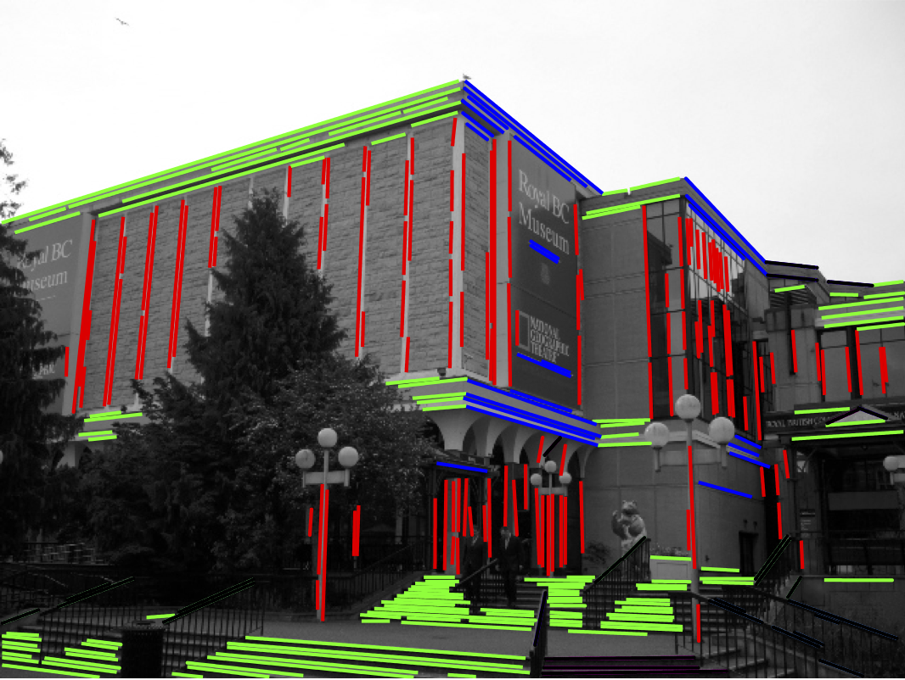|**T. Pham**, T.-J. Chin, K. Schindler and D. Suter   Interacting Geometric Priors for Robust Multi-Model Fitting   IEEE Transactions on Image Processing (2014)|
|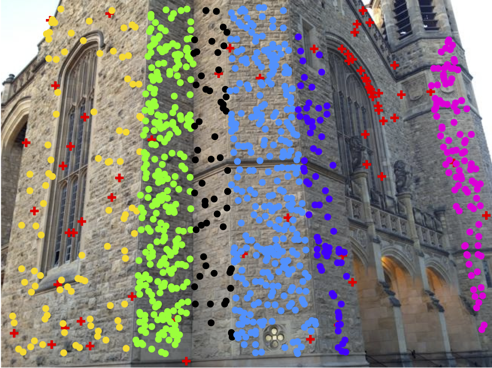|**T. Pham**, T.-J. Chin, J. Yu and D. Suter   The Random Cluster Model for Robust Geometric Fitting    IEEE Transactions on Pattern Analysis and Machine Intelligence (TPAMI) 2013|
|2012||
|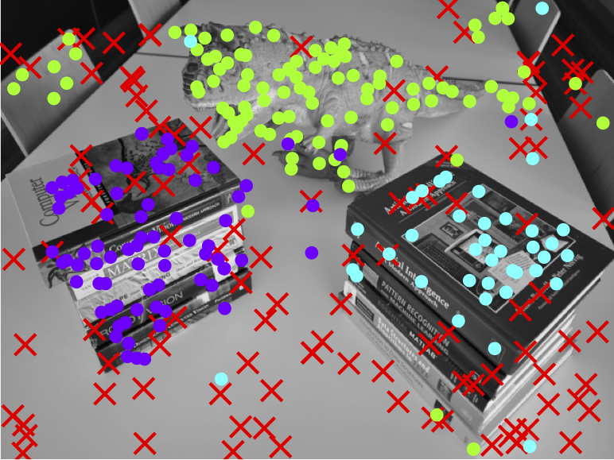|**T. Pham**, T.-J. Chin, J. Yu and D. Suter   The Random Cluster Model for Robust Geometric Fitting    In CVPR 2012, Providence, Rhode Island, USA.|
|2011||
|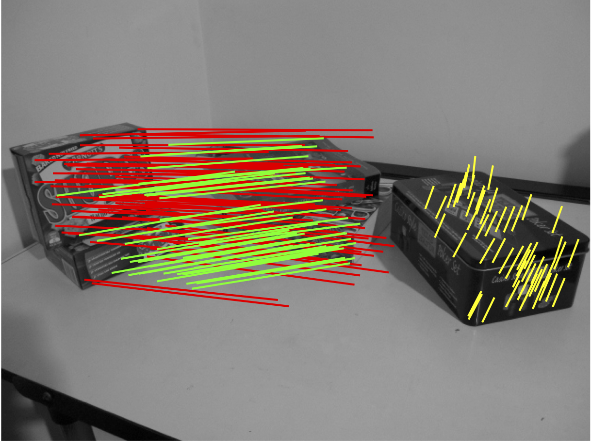|**T. Pham**, T.-J. Chin, J. Yu and D. Suter   Simultaneous Sampling and Multi-Structure Fitting with Adaptive Reversible Jump MCMC    In NIPS 2011, Granada, Spain.|
